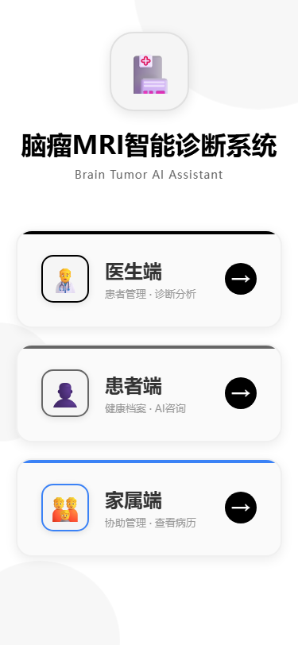
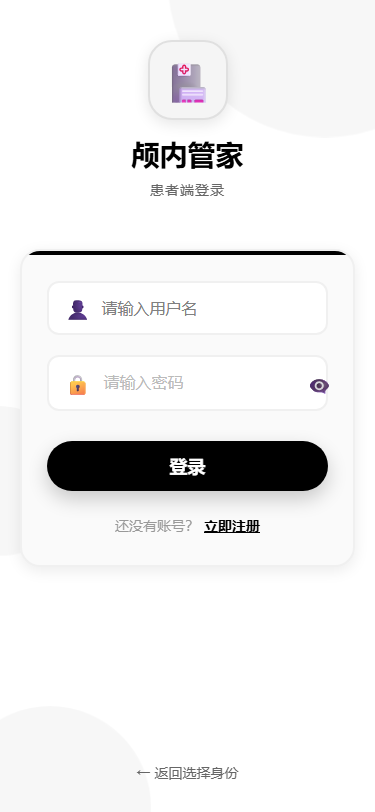
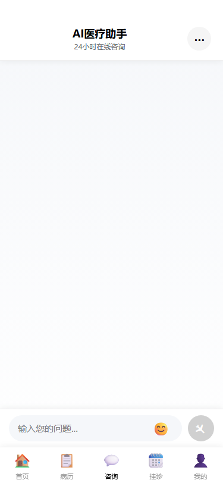
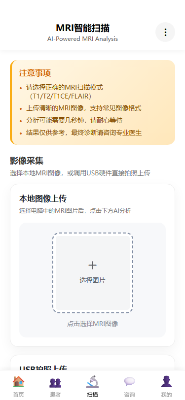

<p align="center">
  
</p>

<h1 align="center">BraiLink</h1>
<p align="center">
  
  
  
  
</p>

<p align="center">
  
</p>

<details open>
<summary><b>🇨🇳 中文</b></summary>

---

## 📖 项目简介

**BraiLink** 是一款基于人工智能的脑瘤辅助诊断医疗助手。系统采用 TransUNet 深度学习模型实现 MRI 脑瘤自动分割，并集成 DeepSeek 大语言模型提供智能医疗咨询。系统支持 **医生**、**患者**、**家属** 三种角色，为脑瘤诊疗提供一站式数字化桥梁。

---

## 📸 应用截图

<div align="center">
  
  
  
  
</div>

<p align="center">
  <sub>身份选择 | 登录 | AI 智能问诊 | CT 影像扫描</sub>
</p>

---

## 🏗️ 技术架构

```
BraiLink/
├── code/
│   ├── backend/                 # Django REST Framework 后端
│   │   ├── accounts/            # 用户认证（医生 / 患者 / 家属）
│   │   ├── patients/            # 患者管理
│   │   ├── doctors/             # 医生管理
│   │   ├── families/            # 家属管理
│   │   ├── appointments/        # 预约挂号
│   │   ├── medical_records/     # 电子病历
│   │   ├── ai_chat/             # AI 医疗咨询
│   │   ├── ml_service/          # ML 推理服务（TransUNet + DeepSeek）
│   │   ├── notifications/       # 系统通知
│   │   └── brain_tumor_api/     # Django 项目配置
│   ├── frontend/                # UniApp 跨平台前端
│   │   ├── pages/               # 20+ 业务页面
│   │   ├── components/          # 可复用组件
│   │   ├── config/              # 环境配置
│   │   └── utils/               # 工具函数
│   └── image_predict/           # ML 模型与推理脚本
└── data/                        # 训练数据（MRI 序列：T1 / T1ce / T2 / FLAIR / Seg）
```

---

## ✨ 核心功能

| 功能 | 说明 |
|------|------|
| 🧠 **AI 肿瘤分割** | 基于 TransUNet 的多序列 MRI 脑瘤自动分割 |
| 💬 **AI 智能问诊** | DeepSeek 驱动的医疗咨询，支持患者病历上下文 |
| 📋 **电子病历管理** | 完整的患者电子健康档案 |
| 📅 **在线预约** | 患者与医生之间的在线预约挂号 |
| 👨‍👩‍👧 **家属绑定** | 家属可绑定患者，协助管理 |
| 🔔 **消息通知** | 预约、报告等实时系统通知 |
| 📰 **医学资讯** | 精选医学新闻，支持分类筛选 |
| 🌐 **跨平台** | 基于 UniApp，支持 Android / iOS / H5 / 微信小程序 |

---

## 🚀 快速开始

### 环境要求

- **Python** 3.10+
- **Node.js** 18+
- **HBuilderX**（用于 UniApp 移动端打包）
- **Redis**（可选，用于 Celery 异步任务）

### 后端

```bash
cd code/backend

# 创建虚拟环境
python -m venv venv
source venv/bin/activate  # Windows: venv\Scripts\activate

# 安装依赖
pip install -r requirements.txt

# 配置环境变量
cp .env.example .env
# 编辑 .env，设置 DEEPSEEK_API_KEY 等配置

# 数据库迁移
python manage.py migrate

# （可选）加载演示数据
python init_demo_data.py

# 启动开发服务器
python manage.py runserver 0.0.0.0:8000
```

### 前端

```bash
cd code/frontend

# 安装依赖
npm install

# 在 config/env.config.js 中配置后端地址

# 浏览器预览（H5）
npm run dev:h5

# 或在 HBuilderX 中打开，打包为 Android / iOS / 微信小程序
```

### ML 模型

下载预训练的 TransUNet 模型权重，放入 `code/image_predict/models/` 目录。

---

## ⚙️ 环境变量

复制 `.env.example` 为 `.env`，配置以下变量：

| 变量 | 说明 | 默认值 |
|------|------|--------|
| `SECRET_KEY` | Django 密钥 | **生产环境必须修改** |
| `DEBUG` | 调试模式 | `True` |
| `DATABASE_ENGINE` | 数据库引擎 | `sqlite3` |
| `DEEPSEEK_API_KEY` | DeepSeek API 密钥 | **AI 聊天功能必需** |
| `FLASK_ML_SERVICE_URL` | ML 服务地址 | `http://localhost:5000` |
| `CELERY_BROKER_URL` | Celery 消息队列 | `redis://localhost:6379/0` |

---

## 👥 用户角色

| 角色 | 功能 |
|------|------|
| 🩺 **医生** | 患者管理、影像诊断、病历查阅 |
| 🏥 **患者** | AI 咨询、预约挂号、健康档案 |
| 👨‍👩‍👧 **家属** | 协助管理患者、查看病历 |

---

## 📄 许可证

本项目基于 MIT License 开源。

---

## 👤 作者

**Enndme-KK** — [GitHub](https://github.com/Enndme-KK)

</details>

<details>
<summary><b>🇬🇧 English</b></summary>

---

## 📖 Introduction

**BraiLink** is an AI-powered medical assistant application designed for brain tumor diagnosis. It leverages deep learning (TransUNet) for automated MRI-based brain tumor segmentation and integrates a large language model (DeepSeek) for intelligent medical consultation. The system supports three user roles — **Doctors**, **Patients**, and **Family Members** — providing a comprehensive bridge for brain tumor diagnosis and communication.

---

## 📸 Screenshots

<div align="center">
  
  
  
  
</div>

<p align="center">
  <sub>Role Selection | Login | AI Medical Chat | CT Scanner</sub>
</p>

---

## 🏗️ Architecture

```
BraiLink/
├── code/
│   ├── backend/                 # Django REST Framework
│   │   ├── accounts/            # User authentication (Doctor/Patient/Family)
│   │   ├── patients/            # Patient management
│   │   ├── doctors/             # Doctor management
│   │   ├── families/            # Family management
│   │   ├── appointments/        # Appointment scheduling
│   │   ├── medical_records/     # Electronic health records
│   │   ├── ai_chat/             # AI medical consultation
│   │   ├── ml_service/          # ML inference (TransUNet + DeepSeek)
│   │   ├── notifications/       # System notifications
│   │   └── brain_tumor_api/     # Django project config
│   ├── frontend/                # UniApp cross-platform frontend
│   │   ├── pages/               # 20+ pages
│   │   ├── components/          # Reusable components
│   │   ├── config/              # Environment config
│   │   └── utils/               # Utility functions
│   └── image_predict/           # ML models & inference scripts
└── data/                        # Training data (MRI: T1/T1ce/T2/FLAIR/Seg)
```

---

## ✨ Features

| Feature | Description |
|---------|-------------|
| 🧠 **AI Tumor Segmentation** | TransUNet-based automated brain tumor segmentation from multi-sequence MRI |
| 💬 **AI Medical Chat** | DeepSeek-powered medical consultation with patient history context |
| 📋 **EHR Management** | Complete electronic health records for patients |
| 📅 **Appointments** | Online appointment scheduling between patients and doctors |
| 👨‍👩‍👧 **Family Binding** | Family members can bind to patients for assisted management |
| 🔔 **Notifications** | Real-time system notifications for appointments and reports |
| 📰 **Medical News** | Curated medical news feed with category filtering |
| 🌐 **Cross-Platform** | UniApp-based: Android, iOS, H5, WeChat Mini Program |

---

## 🚀 Quick Start

### Prerequisites

- **Python** 3.10+
- **Node.js** 18+
- **HBuilderX** (for UniApp mobile build)
- **Redis** (optional, for Celery async tasks)

### Backend

```bash
cd code/backend

# Create virtual environment
python -m venv venv
source venv/bin/activate  # Windows: venv\Scripts\activate

# Install dependencies
pip install -r requirements.txt

# Configure environment
cp .env.example .env
# Edit .env — set DEEPSEEK_API_KEY and other configs

# Run migrations
python manage.py migrate

# (Optional) Load demo data
python init_demo_data.py

# Start server
python manage.py runserver 0.0.0.0:8000
```

### Frontend

```bash
cd code/frontend

# Install dependencies
npm install

# Configure API endpoint in config/env.config.js

# Run in browser (H5)
npm run dev:h5

# Or open in HBuilderX for Android / iOS / WeChat Mini Program build
```

### ML Model

Download the pre-trained TransUNet model weights and place them in `code/image_predict/models/`.

---

## ⚙️ Environment Variables

Copy `.env.example` to `.env` and configure:

| Variable | Description | Default |
|----------|-------------|---------|
| `SECRET_KEY` | Django secret key | **Required in production** |
| `DEBUG` | Debug mode | `True` |
| `DATABASE_ENGINE` | Database engine | `sqlite3` |
| `DEEPSEEK_API_KEY` | DeepSeek API key | **Required for AI chat** |
| `FLASK_ML_SERVICE_URL` | ML service endpoint | `http://localhost:5000` |
| `CELERY_BROKER_URL` | Celery broker | `redis://localhost:6379/0` |

---

## 👥 User Roles

| Role | Capabilities |
|------|-------------|
| 🩺 **Doctor** | Patient management, image diagnosis, medical record review |
| 🏥 **Patient** | AI consultation, appointment booking, health records |
| 👨‍👩‍👧 **Family** | Assisted patient management, medical record viewing |

---

## 📄 License

This project is licensed under the MIT License.

---

## 👤 Author

**Enndme-KK** — [GitHub](https://github.com/Enndme-KK)

</details>

---

<p align="center">
  <sub>Made with ❤️ for better brain tumor diagnosis</sub>
</p>
